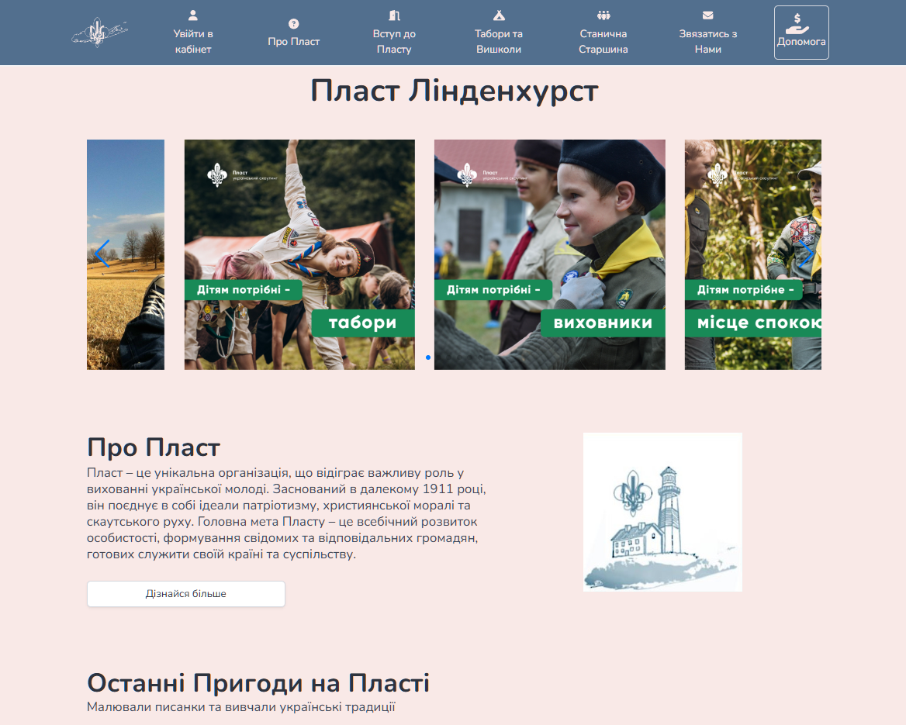

# Scout Business Operation System

[](https://www.gnu.org/licenses/gpl-3.0)
[](https://reactjs.org/)
[](https://www.typescriptlang.org/)
[](https://redux.js.org/)
[](https://graphql.org)
[](https://sass-lang.com/)
[](https://wordpress.org/)

This project is a comprehensive Business Operation System (BOS) designed for a Scout organization. It serves as a central platform for managing members, payments, attendance, and internal communication. The frontend is built with React and TypeScript, while the backend is a headless WordPress instance using GraphQL for data exchange.

## 🚀 Live Demo

[Link to live demo](https://scout-bos-demo.podolskiy.dev)

Project Link: [GitHub](https://github.com/syavaYki/scout-bos-demo)

## 📸 Screenshot



## ✨ Features

- **Member Management:** View, add, and update member information.
- **Attendance Tracking:** Record and monitor attendance for events and meetings.
- **Financial Management:** Process payments for annual fees and other contributions.
- **User Roles & Permissions:** Multiple access levels for different user roles (e.g., admin, leader, member).
- **News and Announcements:** A dedicated section for news and urgent notices.
- **Contact & Intake Forms:** Easy-to-use forms for inquiries and new member registration.
- **Responsive Design:** Fully responsive and accessible on all devices.

## 🛠️ Backend Features

The backend is powered by a headless WordPress, providing a robust and flexible content management system.

- **Headless WordPress:** The backend is decoupled from the frontend, allowing for greater flexibility and scalability.
- **GraphQL API:** Data is exposed through a GraphQL API, providing efficient and precise data fetching.
- **User Database:** All user data is securely stored and managed in the WordPress database.
- **Payment Integration:** Seamlessly integrates with payment gateways like PayPal.
- **Absence Management:** Functionality to manage and track member absences.
- **Fee Management:** System for handling annual fees and other payments.

## 💻 Tech Stack

### Frontend

- **[React](https://reactjs.org/):** A JavaScript library for building user interfaces.
- **[TypeScript](https://www.typescriptlang.org/):** A typed superset of JavaScript that compiles to plain JavaScript.
- **[Redux Toolkit](https://redux-toolkit.js.org/):** The official, opinionated, batteries-included toolset for efficient Redux development.
- **[React Router](https://reactrouter.com/):** For declarative routing in React applications.
- **[Bulma](https://bulma.io/):** A modern CSS framework based on Flexbox.
- **[Sass/SCSS](https://sass-lang.com/):** A CSS preprocessor for more maintainable and powerful stylesheets.
- **[AG-Grid](https://www.ag-grid.com/):** A feature-rich datagrid for React.

### Backend

- **[Headless WordPress](https://wordpress.org/):** A content management system that provides content to other applications.
- **[GraphQL](https://graphql.org/):** A query language for your API.
- **[Apollo Client](https://www.apollographql.com/docs/react/):** A comprehensive state management library for JavaScript that enables you to manage both local and remote data with GraphQL.

### Development & Build

- **[Create React App](https.github.com/facebook/create-react-app):** A comfortable environment for learning React, and is the best way to start building a new single-page application in React.
- **[ESLint](https://eslint.org/):** For identifying and reporting on patterns found in ECMAScript/JavaScript code.
- **[Prettier](https://prettier.io/):** An opinionated code formatter.
- **[Husky](https://typicode.github.io/husky/#/):** For managing Git hooks.
- **[Lint-Staged](https://github.com/okonet/lint-staged):** Run linters on git staged files.

## 🏁 Getting Started

To get a local copy up and running, follow these simple steps.

### Prerequisites

- Node.js
- npm

### Installation

1. **Clone the repo**

   ```sh
   git clone https://github.com/your-repo-link.git
   ```

2. **Navigate to the project directory**

   ```sh
   cd scout-bos-demo
   ```

3. **Install NPM packages**

   ```sh
   npm install
   ```

### Running the Application

To start the development server, run:

```sh
npm start
```

This will open the app in your default browser.

## 📜 Available Scripts

In the project directory, you can run:

- `npm start`: Runs the app in development mode.
- `npm run build`: Builds the app for production to the `build` folder.
- `npm test`: Runs the test runner.
- `npm run lint`: Lints the code using ESLint.
- `npm run build-bulma`: Compiles the custom Bulma styles.

## 📄 License

This project is licensed under the **GNU General Public License v3.0**.

## 👤 Contact

[Seva Podolskiy] - [svyatoslav.podolskiy@gmail.com](mailto:svyatoslav.podolskiy@gmail.com)
